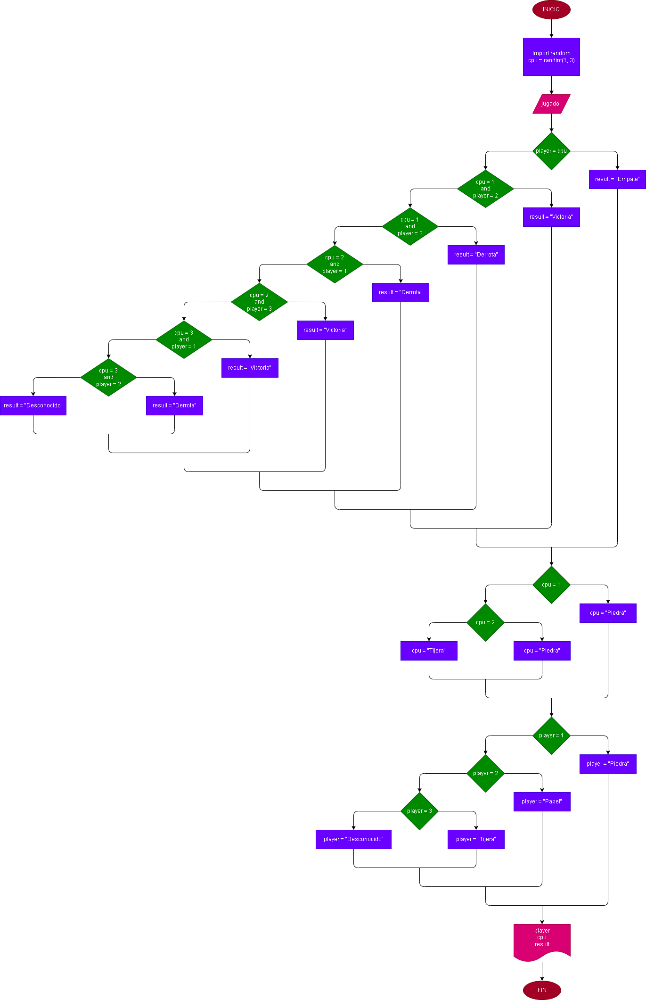

# Cuarzo papiro navaja / Piedra papel tijeras
## Para este proyecto se va a implementar la librería random que nos dara un juego para poder jugar contra la maquina, lo que hara esta es darnos un numero al azar mientras que el usuario eligira otro número y con if se daran las condiciones de victoria, derrota o empate.
## Diagrama de flujo
