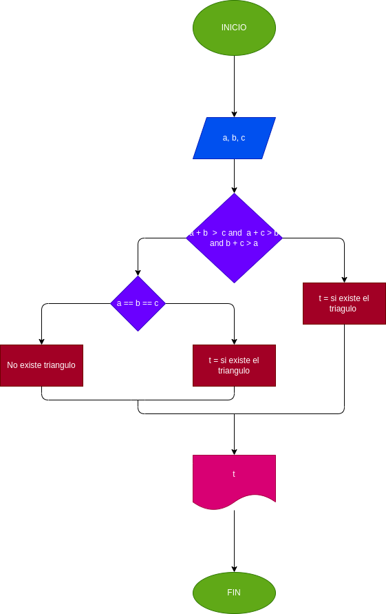

# FORMAR UN TRÍANGULO
## Caso 
Dados tres (3) números a, b, c. Verificar si pueden formar los lados de un tríangulo

## Análisis
Para que el triángulo pueda existir sus lados o segmentos deben cumplir ciertas condiciones. La regla principal que da origen al triángulo tiene que ver con la longitud de sus lados. Esta plantea que la suma de dos de sus lados debe ser mayor a la longitud del tercer lado. Por ejemplo, si dos lados miden cinco y cuatro centímetros respectivamente, el tercero lado debería medir ocho centímetros.

Para que exista un triángulo, sus lados o segmentos deben cumplir ciertas condiciones. La regla principal que crea un triángulo es relativa a la longitud de sus lados. Esto dice que la suma de dos de sus lados debe ser mayor que la longitud del tercer lado. Por ejemplo, si dos lados miden cinco y cuatro centímetros, el tercer lado debe medir ocho centímetros.

Se realizara un codigo que logre comparar la suma de dos de los valores ingresados con el valor restante o sea a + b > c y asi las veces necesarias con todas las posibilidades en un condicional.

## Diagrama de flujo

