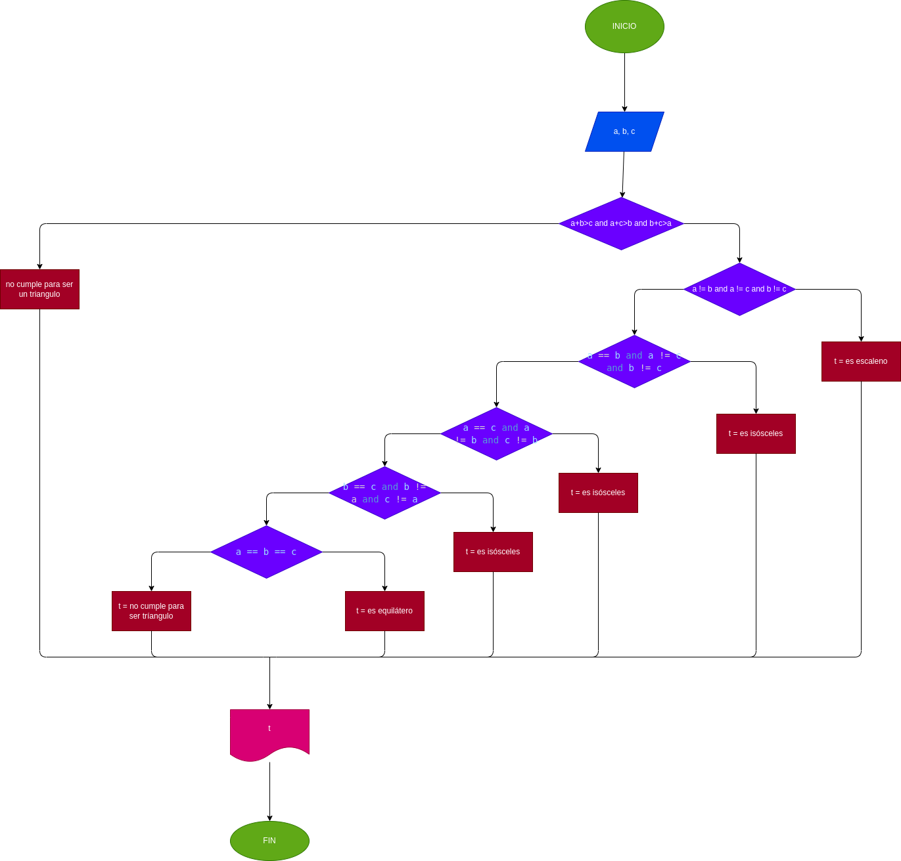

# 
## Determinar si un triángulo es Equilátero, Isósceles, Escaleno
### conceptos
Equilátero: Todos sus lados son iguales.

Isósceles: Dos de sus tres lados son de igual longitud.

Escaleno: Todos sus lados son de diferente longitud.

### Análisis: 
El usuario podra ingresar el valor de los lados del tríangulo, se procesaran y primero se evaluara si se puede forma un triangulo con esos numeros recien ingresados, como segundo se evaluara dependiendo de las caracteristicas de los lados si llega a ser equilátero, isósceles, Escaleno.

## Diagrama de flujo
