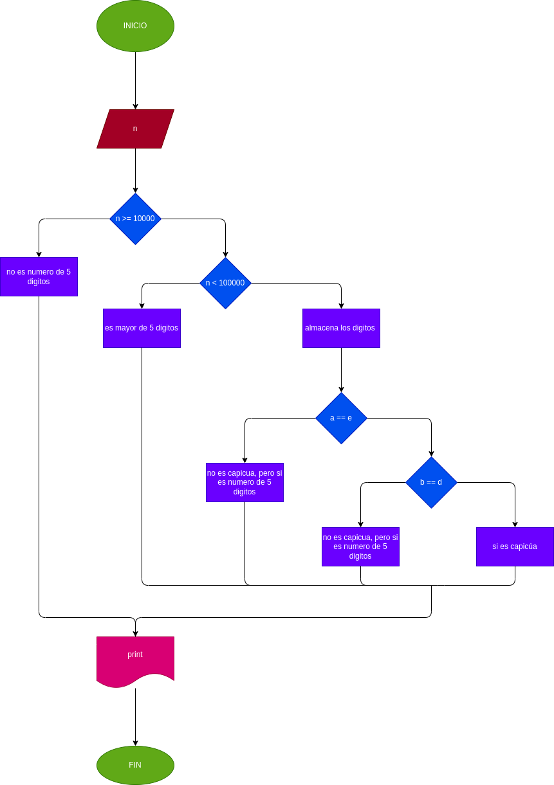

# 
## Quiz - condiciones
### Leer un número entero de 5 digitos y determinar si es capiúa
### ¿Qué es un número capicúa?
#### Un número capiúa se refiere a cualquier número que se lee igual de izquierda a derecha que de derecha a izquierda. Ejemplos: 161, 2992, etc.
## Diagrama de flujo
