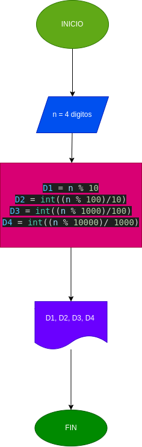

# Dado un múmero de 4 digitos devolverlo en orden inverso
## Formulas
D1 = n % 10

D2 = int((n % 100)/10)

D3 = int((n % 1000)/100)

D4 = int((n % 10000)/ 1000)
 
El operador módulo (%) no hace otra cosa que devolver el resto de la división entre los dos operandos. En el ejemplo, 7 / 2 sería 3, con 1 de resto, luego el módulo es 1.
## Diagrama de flujo
