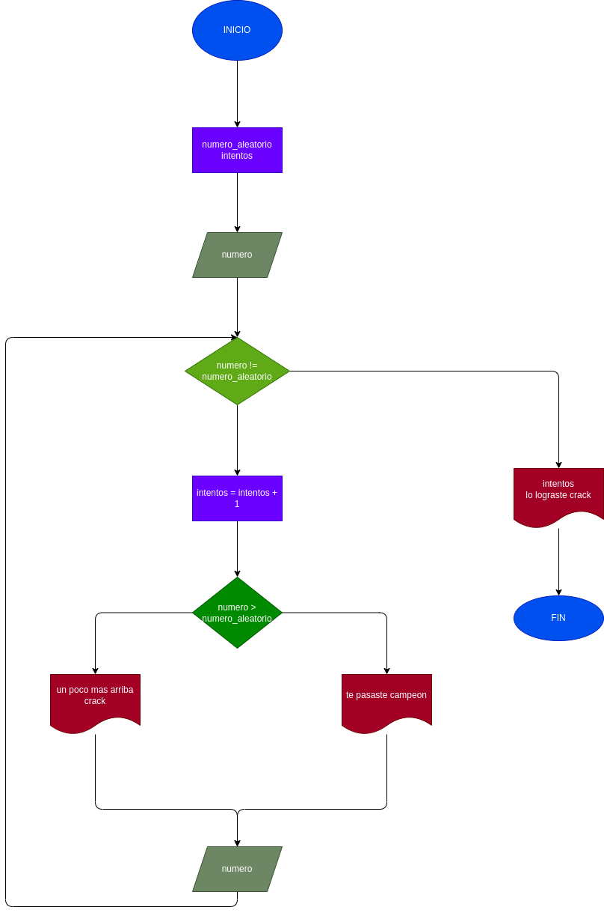

# Adivinar un numero aleatorio
Se busca crear un prgrama en el cual cuenta cuantos intentos le tomo al usuario adivinar el numero dado por el randomizador.
## Análisis 
Se importa el modulo **random** para que nos genere un número aleatorio con "random.randit" y que luego de que el usuario ingrese un número este entrara en un ciclo **While** si no es adivinado a la primera y seguira preguntando el numero hasta que el usuario atine el número, mientras ocurre este ciclo repetitivo se contaran los intentos que llega a realizar el usuario hasta que se llegue al numero que se debe adivinar.
## Diagrama de flujo
