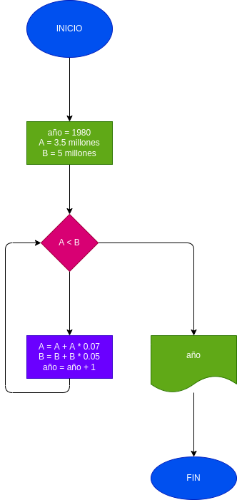

# Crecimiento poblacional ciudades A y B
En 1980 la ciudad A tenia 3.5 millones de habitantes y una rata(tasa) de crecimiento del 7% anual; y la ciudad B tenia 5 millones y una rata(tasa) de crecimiento del 5% anual. Si el crecimiento poblacional se mantiene constante en las dos ciudades, hacer el diagrama de flujo y el programa en Python que calcule e imprima en que año la poblacion de la ciudad A es mayor que la de la ciudad B.

## Análisis
se declaran las variables de las ciudades y en el ciclo while se debe cumplir que la ciudad A debe ser menor en poblacion que la ciudad B y cuando deje de ocurrir esto saldra del while para imprimir los años que trancurrieron

## Diagrama
