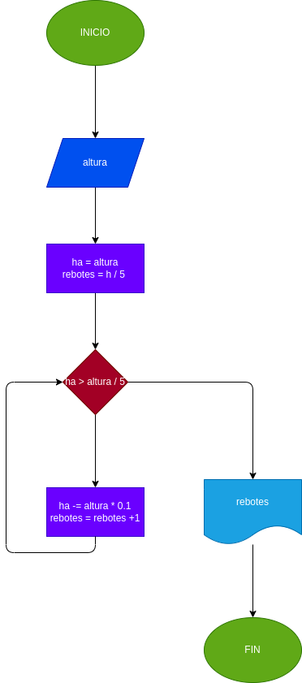

# Rebote Pelota
Una pelota se deja caer desde una altura 'h', y en cada rebote sube el 10% menos de el anterior. Hacer el diagrama de flujo y el programa en Python, que le a 'h', y que calcule e imprima en cual rebote la pelota no alcanza a subir la quinta parte de la altura inicial.

## Análisis
Hacer el diagrama de flujo y el programa en python, que lea numero enteros y positivos (uno en cada lectura), y que averigue e imprima cuantos son pares y cuantos son impares. para terminar usaremos el registrocentinela, cuando el valor del numero leido sea cero.

## Diagrama de flujo
